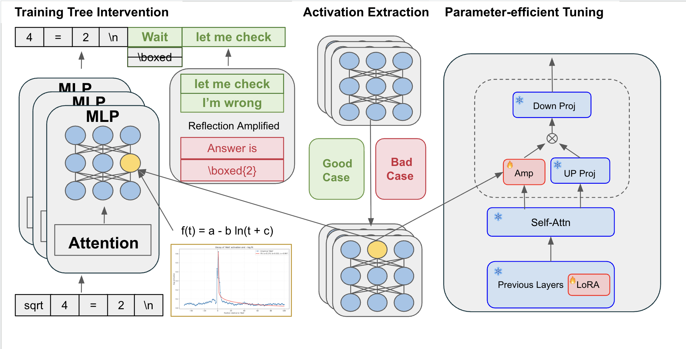

# EELo-CoT

This repository contains code for performing EELo-CoT in a language model during text generation. The system allows configuring different types of intervention functions through a JSON configuration file.

## Overview
Despite the remarkable reasoning performance, eliciting the long chain-of-thought~(CoT) ability in large language models~(LLMs) typically requires costly reinforcement learning or supervised fine-tuning on high-quality distilled data. We investigate the internal mechanisms behind this capability and show that a small set of high-impact activations in the last few layers, greatly govern the long-form reasoning attributes, \eg output length and self-reflection. Through simply amplifying these activations and adding ``wait'' tokens, the long CoT ability can be invoked without training, leading to significantly increased self-reflection rate and accuracy. In addition, we also find that the activation changes follow predictable trajectories, \ie a sharp rise after special tokens and a subsequent exponential decay. Based on these insights, we introduce a general training-free activation control technique. It utilizes a few contrastive examples to identify the relevant activations, and then incorporates simple analytic functions to adjust their values at inference time to elicit long CoTs. Extensive experiments have verified the effectiveness of our methods in efficiently eliciting the long CoT ability of LLMs and improving the performance. Besides, we further propose a parameter-efficient fine-tuning method that trains only the last-layer activation amplification module and a few LoRA layers, outperforming LoRA on reasoning benchmarks with much fewer parameters.




## Environment
install Python 3.10.16  
install Pytorch 2.7.0  
install Transformer 4.51.3  
```python
pip install torch==2.7.0 torchvision==0.18.0 torchaudio==2.7.0 --index-url https://download.pytorch.org/whl/cu121
pip install transformers==4.51.3
```

## Repository Structure
```
├── inference_probing.py     # Main code for running inference with interventions
├── intervene_functions.py   # Implementation of intervention functions
├── model.py                 # Model definition with intervention support
├── intervene_config.json    # Configuration file for interventions
└── results/                 # Directory for output results
```

## Running the Code
First create a grid1 folder under the configs folder.
Then, run 
```python
python create_grid.py
```

Finally, run 
```python
python inference_probing.py \
  --config configs/grid1 \
  --num_gpus 7 \
  --output_dir results
```
